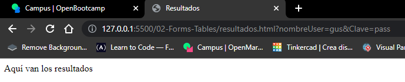

# HTML intro
[//]: <> (por comodidad voy a usar un solo archivo MarkDown para varias clases sino todas.)
## Instalación de plugins video N.º 2 Y su utilización

Nada demasiado importante, ver luego como habilitar live server para que actualice automáticamente, minuto 14.

* Creo la carpeta 01-introducción
* El profesor recomienda usar chrome por las herramientas para devs. se pueden inspeccionar elementos e incluso hacer 
* cambios.

Por ahora solo explicación de etiquetas sencillas y comentarios.

### Instale better comments funciona dentro del comentario por defecto sino NO

 

Habiendo configurado *prettier* como estilo de **formato de documento** con la combinación `shift + alt + f` mejora 
el formato de manera automática.

## Clase N°1 
### Etiquetas Habituales

Cuando utilizo VsCode me ofrece vincular con el archivo existente de manera interna.

***Automáticamente, intelJ que es donde me es más cómodo utilizar Mark Down por el uso de imágenes me crea su carpeta y 
decido agregarla a git en vez de usar git ignore***

* Cada elemento dentro de las etiquetas capaz de modificarla se llama atributo.

## Clase N°2 
### Formularios

En este caso con clic derecho abro la página con live server la extension para que actualice automáticamente.
Creamos formulario muy básico con sus etiquetas ingresamos los datos con input, luego creamos otra html para alojar 
los datos.

Hay 2 *métodos* para esto uno es `GET` y el otro `POST` el primero get se utiliza para html, el segundo se utiliza para 
interactuar con servidores y BB DD.

En nuestro ejemplo utilizamos el método `GET` y para que se pueda acceder en la etiqueta input es necesario establecer 
un nombre ``name`` 
#### Cargo los datos
 
#### Quedan almacenados y se ven el la barra de dirección

#### Con este ejemplo muestro que si solo creo la etiqueta y campo, pero no agrego los atributos este existe pero no se guarda
     

Ahora si con atributos para comentarios:

Para saber acerca de los atributos dentro de las etiquetas puedo consultar la documentación 
en: https://www.w3schools.com/tags/ref_attributes.asp.

### Botones

    

