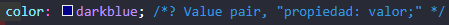

# HTML intro
[//]: <> (por comodidad voy a usar un solo archivo MarkDown para varias clases sino todas.)
## Instalación de plugins video N.º 2 Y su utilización

Nada demasiado importante, ver luego como habilitar live server para que actualice automáticamente, minuto 14.

* Creo la carpeta 01-introducción
* El profesor recomienda usar chrome por las herramientas para devs. se pueden inspeccionar elementos e incluso hacer 
* cambios.

Por ahora solo explicación de etiquetas sencillas y comentarios.

### Instale better comments funciona dentro del comentario por defecto sino NO

 

Habiendo configurado *prettier* como estilo de **formato de documento** con la combinación `shift + alt + f` mejora 
el formato de manera automática. **No sé, por qué hubo una actualización y pensé que se había roto la app**

Descargué un diccionario inglés y uno español abarca el espacio de trabajo y la sección de carpetas también, 
con crt +. me ofrece las correcciones.

#### Path Intellisense: Me resolvió el tema de insertar imágenes de otra carpeta en VsCode
Para insertar multimedia pongo "/" y me abre las rutas gracias al plugin nuevo 

## Clase N°1 
### Etiquetas Habituales


Cuando utilizo VsCode me ofrece vincular con el archivo existente de manera interna.

***Automáticamente, intelJ que es donde me es más cómodo utilizar Mark Down por el uso de imágenes me crea su carpeta y 
decido agregarla a git en vez de usar git ignore***

* Cada elemento dentro de las etiquetas capaz de modificarla se llama atributo.

## Clase N°2 
### Formularios


En este caso con clic derecho abro la página con live server la extension para que actualice automáticamente.
Creamos formulario muy básico con sus etiquetas ingresamos los datos con input, luego creamos otra html para alojar 
los datos.

Hay 2 *métodos* para esto uno es `GET` y el otro `POST` el primero get se utiliza para html, el segundo se utiliza para 
interactuar con servidores y BB DD.

En nuestro ejemplo utilizamos el método `GET` y para que se pueda acceder en la etiqueta **input** es necesario establecer 
un nombre ``name`` también `id` y si quiero que sea un campo obligatorio le agrego el atributo `required`
#### Cargo los datos
 
#### Quedan almacenados y se ven el la barra de dirección

#### Con este ejemplo muestro que si solo creo la etiqueta y campo, pero no agrego los atributos este existe pero no se guarda
     


Ahora si con atributos para comentarios:


Para saber acerca de los atributos dentro de las etiquetas puedo consultar la documentación 
en: https://www.w3schools.com/tags/ref_attributes.asp.

### Botones
Dos de los botones más utilizados son, según su acción `submit` y `reset`. 

En sus respectivos inputs a través de sus atributos establezco el tipo ``type`` en nombre texto y en contraseña password.
Otros ejemplos son número, e-mail, fecha.. sencillamente, me va a requerir esos tipos de datos.


### Tablas
Al menos en la 1.er clase no hay demasiado para explicar, las etiquetas son sencillas y la tabla si no le pasamos formato 
va tomando forma sola. 

etiquetas de esta clase: ``<table> / <th> / <td>``
 Ejercicio n.º 2:
 


Lo interesante del resultado es que el **live server** abrio la carpeta superior a donde está creado este trabajo.

 

Sin live server, o sea "open in default browser" arrojó este resultado.

**En github el ejercicio siguiente.**

## Clase nº3 
### Multimedia

#### Imágenes
*He descargado una imagen un video y un audio para explicar las etiquetas.* https://www.w3schools.com/html/html_images.asp

The `` tag has two required attributes:

``src`` - Specifies the path to the image
``alt`` - Specifies an alternate text for the image

````

Para usar imágenes de internet puedo copiar la dirección de imagen.

#### Videos
Los navegadores soportan varios formatos, se puede manipular altura y ancho como enm las imágenes, también utilizar 
autoplay aunque no es muy recomendado. Son útiles los atributos, ``mute`` y ``loop``.

#### Audio
Muy similar a video en este caso utilizo la sintaxis del profesor a diferencia de video que use la sugerida por vsCode.

## Clase nº4
### Intro a las hojas de estilo (CSS)
Custom Style Sheet = css

 Creación de la hoja de CSS. 
#### Para relacionarlo con la html desde dentro de head creo un link a CSS.


Le informo que es una hoja de estilo y brindo la ruta.

Comenzando con lo básico:
en esta sencilla etiqueta, digo que modifique todos los ``H1``, los parámetros van entre ``{}`` y esta vez solo modifiqué 
el color de la fuente.

    


Para inspeccionar elementos, los selecciono --> luego click derecho --> inspeccionar. 
La herramienta de google me dice que es un h1 y muestra su estilo en css.

 


### Selectores en CSS

Para poder diferenciar y modificar etiquetas por ejemplo didtintos párrafos usamos **SELECTORES** hay 5 grandes 
tipos los 2 más importantes son:
* **clases** --> *toda una clase con atributos comunes*
* **id** --> *un único elemento modificado*

En html en las respectivas etiquetas creo el selector particular y en css una vez relacionados hago las modificaciones
o reglas de estilo. https://www.w3schools.com/css/css_selectors.asp

HTML para llamar a las dos: 

#### Ejemplo con Class: la sintaxis es `.` + `nombre clase` (sin espacios)


#### Ejemplo con ID: la sintaxis es `#` mas nombre `id`


#### Selector universal
Con `*` puedo hacer selecciones universales a didtintos elementos, botones, párrafos, títulos etc. 
y algunas mezclas por ejemplo en la noticia cuatro, class warning + id.


En el último ejemplo agrupo reglas en clases, encabezados etc. 

 

