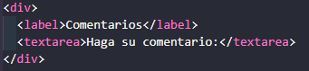

# HTML intro
[//]: <> (por comodidad voy a usar un solo archivo MarkDown para varias clases sino todas.)
## Instalación de plugins video N.º 2 Y su utilización

Nada demasiado importante, ver luego como habilitar live server para que actualice automáticamente, minuto 14.

* Creo la carpeta 01-introducción
* El profesor recomienda usar chrome por las herramientas para devs. se pueden inspeccionar elementos e incluso hacer 
* cambios.

Por ahora solo explicación de etiquetas sencillas y comentarios.

### Instale better comments funciona dentro del comentario por defecto sino NO
 

Habiendo configurado *prettier* como estilo de **formato de documento** con la combinación `shift + alt + f` mejora 
el formato de manera automática. **No sé, por qué hubo una actualización y pensé que se había roto la app**

Descargué un diccionario inglés y uno español abarca el espacio de trabajo y la sección de carpetas también, 
con crt +. me ofrece las correcciones.

#### *Path Intellisense:* Me resolvió el tema de insertar imágenes de otra carpeta en VsCode
Para insertar multimedia pongo "/" y me abre las rutas gracias al plugin nuevo 

* Para seleccionar y modificar varias líneas a la vez en VsCode usar `alt` + `clic izq.`

* Para ajuste de línea `alt` + `z`
## Clase N°1 
### Etiquetas Habituales


Cuando utilizo VsCode me ofrece vincular con el archivo existente de manera interna.

***Automáticamente, intelJ que es donde me es más cómodo utilizar Mark Down por el uso de imágenes me crea su carpeta y 
decido agregarla a git en vez de usar git ignore***

* Cada elemento dentro de las etiquetas capaz de modificarla se llama atributo.

## Clase N°2 
### Formularios


En este caso con clic derecho abro la página con live server la extension para que actualice automáticamente.
Creamos formulario muy básico con sus etiquetas ingresamos los datos con input, luego creamos otra html para alojar 
los datos.

Hay 2 *métodos* para esto uno es `GET` y el otro `POST` el primero get se utiliza para html, el segundo se utiliza para 
interactuar con servidores y BB DD.

En nuestro ejemplo utilizamos el método `GET` y para que se pueda acceder en la etiqueta **input** es necesario establecer 
un nombre ``name`` también `id` y si quiero que sea un campo obligatorio le agrego el atributo `required`
#### Cargo los datos
 
#### Quedan almacenados y se ven en la barra de dirección

#### Con este ejemplo muestro que si solo creo la etiqueta y campo, pero no agrego los atributos este existe pero no se guarda
     


Ahora si con atributos para comentarios:


Para saber acerca de los atributos dentro de las etiquetas puedo consultar la documentación 
en: https://www.w3schools.com/tags/ref_attributes.asp.

### Botones
Dos de los botones más utilizados son, según su acción `submit` y `reset`. 

En sus respectivos inputs a través de sus atributos establezco el tipo ``type`` en nombre texto y en contraseña password.
Otros ejemplos son número, e-mail, fecha.. sencillamente, me va a requerir esos tipos de datos.


### Tablas
Al menos en la 1.er clase no hay demasiado para explicar, las etiquetas son sencillas y la tabla si no le pasamos formato 
va tomando forma sola. 

Etiquetas de esta clase: ``<table> / <th> / <td>``
 Ejercicio n.º 2:
 


Lo interesante del resultado es que el **live server** abrio la carpeta superior a donde está creado este trabajo.

 

Sin live server, o sea "open in default browser" arrojó este resultado.

**En github el ejercicio siguiente.**

## Clase nº3 
### Multimedia

#### Imágenes
*He descargado una imagen un video y un audio para explicar las etiquetas.* https://www.w3schools.com/html/html_images.asp

The `` tag has two required attributes:

``src`` - Specifies the path to the image
``alt`` - Specifies an alternate text for the image

````

Para usar imágenes de internet puedo copiar la dirección de imagen.

#### Videos
Los navegadores soportan varios formatos, se puede manipular altura y ancho como enm las imágenes, también utilizar 
autoplay aunque no es muy recomendado. Son útiles los atributos, ``mute`` y ``loop``.

#### Audio
Muy similar a video en este caso utilizo la sintaxis del profesor a diferencia de video que use la sugerida por vsCode.

## Clase nº4
### Intro a las hojas de estilo (CSS)  
***Con ctrl + ç inserto comentario en VsCode***

Custom Style Sheet = css

 Creación de la hoja de CSS. 
#### Para relacionarlo con la html desde dentro de head creo un link a CSS.


Le informo que es una hoja de estilo y brindo la ruta.

Comenzando con lo básico:
en esta sencilla etiqueta, digo que modifique todos los ``H1``, los parámetros van entre ``{}`` y esta vez solo modifiqué 
el color de la fuente.

    


Para inspeccionar elementos, los selecciono --> luego click derecho --> inspeccionar. 
La herramienta de google me dice que es un h1 y muestra su estilo en css.

 


### Selectores en CSS

Para poder diferenciar y modificar etiquetas por ejemplo distintos párrafos usamos **SELECTORES** hay 5 grandes 
tipos los 2 más importantes son:
* **clases** --> *toda una clase con atributos comunes*
* **id** --> *un único elemento modificado*

En html en las respectivas etiquetas creo el selector particular y en css una vez relacionados hago las modificaciones
o reglas de estilo. https://www.w3schools.com/css/css_selectors.asp

HTML para llamar a las dos: 

#### Ejemplo con Class: la sintaxis es `.` + `nombre clase` (sin espacios)


#### Ejemplo con ID: la sintaxis es `#` más nombre `id`


#### Selector universal
Con `*` puedo hacer selecciones universales a distintos elementos, botones, párrafos, títulos etc. 
y algunas mezclas por ejemplo en la noticia cuatro, class warning + id.


En el último ejemplo agrupo reglas en clases, encabezados etc. 

 

### Las tres formas de insertar estilos
1. Desde una hoja de estilo CSS a través de un link
2. Con la etiqueta style dentro de head
3. Insertando una hoja CSS desde una url externa
4. Como agregado se puede dar estilo desde un elemento particular en su etiqueta de apertura.

Ejemplo en carpeta **04-Intro-css** página **utilidadesCss**

### Colores
https://coolors.co/ = pagina para paletas de colores
clase muy básica ver la herramienta coolors, esta muy buena.

 Salida 

### Fondos de colores e imágenes
#### Tres formas más comunes 
* colores básicos
* insertar desde URL
* insertar desde archivo

También se pueden manejar los ejes x e y, en la sintaxis va a ser primero horizontal luego vertical
 


### Estilos de altura anchura padding y margin
**¡Solo a modo de ejemplo porque usar ancho y largo en pixeles no es responsive!!!**

   
 
* Padding: es el espacio interno, se puede manipular individualmente: izq. der. arriba, abajo o de manera general.


* Margen: es el espacio por fuera del elemento la distancia a otros elementos. 
 

### Fuentes en CSS
* La primera opción es usar las fuentes por defecto, no todas soportan todos los parámetros como peso por ejemplo.
* La segunda es importar desde **google fonts** u otra URL. 

* A su vez hay dos formas de importar desde el link y pegarlo en el head de html o copiar el estilo en css.
* Estas 2 formas están explicadas en los comentarios de las capturas y en el texto de html también.


SALIDA


## Clase Nº5
### Disposiciones y alineaciones == Block and Inline Elements
https://www.w3schools.com/html/html_blocks.asp 

#### Hay dos valores de visualización: bloque y en línea.
##### *Elementos a nivel de bloque*
Un elemento a nivel de bloque siempre comienza en una nueva línea y los navegadores automáticamente agregan algo de 
espacio (un margen) antes y después del elemento.

Un elemento a nivel de bloque siempre ocupa todo el ancho disponible (se extiende hacia la izquierda y hacia la derecha
tanto como puede).

Dos elementos de *bloque* de uso común son: ``<p>`` y `<div>`.

* El elemento`<p>` define un párrafo en un documento HTML.

* El elemento`<div>` define una división o una sección en un documento HTML.

El elemento ` <p>` es un elemento a nivel de bloque al igual que `<div>`.

##### *Elementos en línea*
Un elemento en línea no comienza en una nueva línea solo ocupa el ancho necesario.

Por ejemplo `spam`.

La diferencia entre **display** *inline* y *block* es que en el primero solo puedo cambiar el ancho porque por defecto 
se ajusta a la altura de la línea, en cambio, *block* e *inline-block* ajusto ambos ejes X e Y.

### Posicionamiento
En este caso con los comentarios de los dos documentos html y css es suficiente.
* para probar como funcionan usar el navegador en una ventana muy chica y utilizar el scroll.
### FlexBox (vistas responsive)
`Display flex` va a hacer que todo lo que este dentro de un contenedor se ordene dentro de sus límites.


hay muchas opciones asi que dejo el link a la cheat sheet https://i.redd.it/vd9dc7wfk9471.png

grid cheat sheet https://www.reddit.com/r/webdev/comments/okwrtx/grid_css_cheat_sheet/

para ver el flex de manera interactiva: https://codepen.io/enxaneta/full/adLPwv

### Overflow
https://www.w3schools.com/css/css_overflow.asp

The CSS overflow property controls what happens to content that is too big to fit into an area.
No guardo imagen, simplemente muestra distintas formas de tratar textos grandes que desbordan el contenedor.

### Trabajando la opacidad y galerías de imágenes
https://www.w3schools.com/css/css_image_transparency.asp

The opacity property specifies the opacity/transparency of an element. The opacity property can take a value 
from 0.0 - 1.0. The lower the value, the more transparent.

También se trabajó hover

### Reproductores de vídeo
En esta lección se estableció un video como fondo de una página

## Clase Nº6
### Anidación de selectores
Con el ejemplo de las carpetas de windows de padres a hijos puedo ir anidando selectores de lo general a lo particular
teniendo cuidado de no sobreescribir.

Una de las ventajas es reducir el código en CSS 
### Pseudo clases
https://www.w3schools.com/css/css_pseudo_classes.asp

What are Pseudo-classes?
A pseudo-class is used to define a special state of an element.

For example, it can be used to:

* Style an element when a user mouses over it

* Style visited and unvisited links differently

* Style an element when it gets focus

### Pseudo elementos
https://www.w3schools.com/css/css_pseudo_elements.asp

Todos los elementos tienen un after y un before, muy sencilla y amena la clase, voy a copiar y pegar desde el repo
y ante la duda la clase es tan corta que la vuelvo a ver. 
### Especificidad
https://www.w3schools.com/css/css_specificity.asp

https://specificity.keegan.st/ calculadora !!!!

What is Specificity?
If there are two or more CSS rules that point to the same element, the selector with the highest specificity 
value will "win", and its style declaration will be applied to that HTML element.

Think of specificity as a score/rank that determines which style declaration are ultimately applied to an element.

 Ver en la página W3Schools está bien explicado, básicamente a cada nivel le corresponde un valor numérico y se
 suman si se combinan.
 
 
https://designshack.net/articles/css/what-the-heck-is-css-specificity/


Posicionado sobre el selector me muestra el n.º de especificidad.
* `!important` vence a todos los niveles.