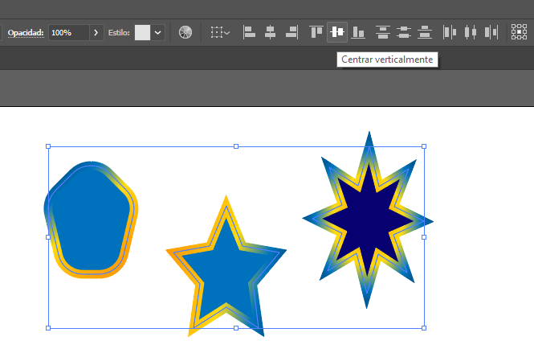
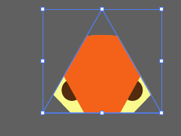

# Illustrator Platzi
## Clase 3
CMYK para impresión 
RGB para digital
en la aplicación Artboards son la cantidad de mesas de trabajo que voy a tener, (Paginas). 

para cambiar y resetear las mesas de trabajo

**Herramienta de selección** = Es la herramienta por defecto que nos muestra Illustrator al comenzar. Nos ayuda a poner 
manipular todos los objetos que tengamos en nuestra mesa de trabajo. _El shortcut para esta herramienta es V_.

**Mano** (hand) = _El shortcut para esta herramienta es H_. Haciendo click y arrastrando nos permite movernos en nuestros 
espacios de trabajo. Una forma rápida de usar esta herramienta es manteniendo oprimida la `barra espaciadora` mientras 
estamos en la herramienta de selección.

**Zoom** = _El shortcut de esta herramienta es Z_. Nos permite acercarnos o alejarnos de nuestros espacios de trabajo. Al 
seleccionar la herramienta la acción que podemos hacer es aumentar el zoom, si mantenemos oprimida la tecla `alt` podemos 
cambiar esta acción para disminuir el zoom.

## Clase 4
### Para tomar en cuenta:

* La implementación de artboards en Illustrator fue a partir de su versión CS4.
* Si los artboards se entrecruzan, el que tenga el borde izquierdo más cercano a la posición del click, será el 
artboard activo.
* Para borrar un artboard se puede hacer click en la X que se encuentra en la esquina superior derecha. 
**Me funcionó doble click y eliminar** también con `del` o `supr` estando seleccionado el artboard

Las herramientas tienen un pequeño menu contextual que las explica (una genialidad asi que no voy a entrar en detalle 
en este resumen)

Una de las formas de duplicar cualquier cosa inclusa artboards es con la herramienta **_mesa de trabajo_** presionar 
`alt` va a aparecer una flecha doble, luego arrastrar y eso crea un duplicado.

Icono opciones para este menú.

## Clase 7 

La línea roja representa el relleno y el cuadradito el color de la línea.

Importante diferenciar la herramienta selector de selector de objetos para poder transformar colores y formas de 
relleno y línea.

Los puntos me permiten redondear los bordes y si quiero hacerlo de manera individual en el panel lateral desbloqueo 
la cadena.  
    /////      ////////    

Para las **_elipses_** si presiono `alt` fija el punto central lo ancla, con `shift` hace un círculo perfecto.

Para los **polígonos** y **estrellas** con las flechas del teclado arriba y abajo sumo o resto lados ejemplo de pentágono a hexágono.
También se pueden sumar o restar desde uno de los nodos que tienen las formas al igual que el redondeo de bordes, 
y mantiene el uso de `alt` para el centro y `shift` para la forma.

## Clase 8
### Pluma
si hago click en distintos puntos trazo rectas, si mantengo el botón izq. apretado trazo curvas y si corro los puntos de 
los manejadores cambio la forma de la curva. Si estoy trazando curvas y hago click sobre el último nodo mato un manejador 
y la convierto en recta,

  

## Clase 9 
### pinceles
desde el panel superior puedo elegir el tipo de trazo y en el panel de la derecha por ejemplo la terminacion de las 
lineas.
  

Con el pincel de manchas puedo rellenar mucho más fácil es para eso. 

Como se ve en la imagen los nodos estan fuera de las líneas y se pueden estirar para cubrir más.
## Clase 10
### Cómo funciona la herramienta de Buscatrazos
El Buscatrazos o en inglés Pathfinder es una de las herramientas que se encuentra en la derecha que al hacer click en 
ellas se despliega mostrando todas sus opciones y tiene un icono de dos cuadrados. Nos permite combinar varios objetos 
utilizando modos de interacción. Estos modos de interacción pueden ser:

* Trazos compuestos: Permiten utilizar un objeto para cortar un agujero en otro objeto.
* Formas compuestas: Permiten combinar varios objetos y especificar cómo desea que cada objeto interactúe con los demás.

   No estaba, busque y anclé la herramienta.

Para trabajar con el Buscatrazos lo que debemos hacer es, seleccionar varios objetos o formas.
Las opciones vistas en la clase son llamadas Modos de forma, y son las siguientes, de izquierda a derecha:

* La primera opción nos unifica nuestras formas creando una sola.
* La segunda resta o elimina la forma que se encuentre encima.
* La tercera mantiene solo la intersección de los dos objetos o formas.
* La cuarta hace lo contrario, elimina la intersección y mantiene lo demás.

**DATOS A RECORDAR:**

Recuerda que para duplicar algo en Illustrator se hace con Selección (V) y mientras le das click y lo mueves mantienes
alt.

Para seleccionar varios objetos individualmente, en vez de seleccionarlos todos encerrándolos con el cursor, 
podemos darle click a uno y manteniendo shift darle click al otro.

Recuerda que cada vez que creamos un nuevo objeto, este quedará encima del anterior.

   

## Clase 11
### Importar imágenes y capas en Illustrator
Importe un .png arrastrando desde una carpeta, voy a capas 

* con el ojo la muestra o no
* con el candado se bloquea 
* con la flecha se despliegan todos los objetos de la capa
* con el círculo selecciono ese objeto en particular este donde este, Muy útil cuando están detrás de otros objetos.
* La capa más nueva siempre va arriba y queda adelante, si quiero llevar algo atrás desde el panel de capas lo bajo una 
posición más que la del objeto que quiero este delante

     

Una de las formas de trabajar para copiar dibujos es a través de formas geométricas simples cortando lo que no sirve 
y manejando las capas.

En esta imagen con el busca trazos selecciono las 2 y borro la diferencia.

Con esa herramienta si selecciono varios objetos los alinea verticalmente

Cuando creo objetos compuestos es conveniente agrupar los objetos que lo componen 
* con `ctrl + g` agrupo los seleccionados

## Clase 12
### Cómo utilizar Degradados en Illustrator

Haciendo doble click en un grupo comienzo a trabajar en sus capas con `esc`, click en la flecha o doble click afuera 
del objeto salgo.
Con la flecha blanca también puedo seleccionar a cada objeto por separado. 

El cuentagotas nos permite copiar propiedades de un objeto. Si nos paramos con el cuentagotas sobre un objeto y damos
click, éste va a copiar los estilos del objeto para después aplicarlos sobre el objeto donde nos paremos en seguida.

En Illustrator, por defecto existe un color para los degradados, mismo que podemos modificar en el panel de herramientas 
del degradado. Los colores se definen mediante paradas a lo largo del regulador que tiene el degradado, así podemos 
realizar la mezcla de colores que queramos o necesitemos.

 al lado del color sólido tengo el degradado, y en el panel de control lo hago lineal o 
radial y le cambio colores y ángulo.

para trabajar bien hay que des agrupar
para elegir colores con doble click en los controles del degradado elijo colores 

En ese circulito cambio el color.

por ultimo para usar el cuenta gotas en uno solo de los tonos del degradado lo hago con `ctrl` `i` + `shift` o doble
click para esta version.

## Clase 13 mascaras

Las máscaras se pueden aplicar a cualquier imagen, a cualquier vector o a cualquier grupo de vectores.

Para tomar en cuenta:

* Si bien se puede enmascarar cualquier ilustración, sólo los objetos vectoriales pueden ser máscaras.

Las máscaras son no destructivas no se pierden los elementos, un ejemplo seria como ver por el ojo de una cerradura la 
mascara solo me deja ver una parte pero todo está ahí

Pasos:
1. creo la imagen/forma que va a ser la máscara
2. la coloco donde la voy a usar
3. el objeto que este encima va a ser la máscara define la nueva forma por eso lo debo subir en la parte de capas
4. posicionado encima selecciono todo el grupo más el vector máscara y selecciono make clipping mask 

**Agrego una textura como mascara.**
En el caso de tener agrupado, des agrupo y selecciono el objeto a texturizar
traigo a la mesa de trabajo la textura seleccionada y le doy escala aproximada.
Luego aunque quede sobre todo lo demás pongo la textura en donde debe quedar
arrastro en capaz la forma a texturizar 
selecciono los dos y de nuevo make clipping mask

Acá es donde llevo adelante la forma

Con la máscara de recorte termino

### Clase 14 Trazos avanzados con la herramienta Pluma
Al trabajar con la herramienta pluma se debe tomar en cuenta que mientras menos nodos tengamos, más limpio va a ser 
nuestro trazo.
Debemos una vez terminado nuestro trazo dar una mirada para ver qué cosas podemos refinar y qué cosas podemos mejorar 
en nuestro trazo.

exporto y bloqueo un dibujo

**Para hacer más fácil el trabajo voy a calcar letra por letra.**

**Usando reglas: no la podía girar hasta que fui a la ventana transformar y cambie ahi el ángulo. También lleve el 0 al 
inicio del dibujo arrastrando el ángulo.** ***las bloquee para que no molesten***

* Pluma: con un click hacia líneas si mantenía apretado el botón del mouse hacia las anclas (bezier) para curvas**  
* Para sumar nodos desde un nodo existente hago clik y sigo dibujando, para restar nodos `supr` 
* Para hacerlos rectos o curvos hay una herramienta en la barra.`(img.)` seleccionar con la herramienta `selección directa`
haciendo una ventana alrededor del nodo.
* Es mas fácil si la linea y el relleno tiene cierta transparencia. 
* Al momento no me sale aislar opacidad por separado de línea y relleno

        
**Agregue la herramienta transparencia el panel**

La A la hice en dos partes el exterior y su agujero luego seleccione los dos y borre el agujero con el `buscatrazos`

